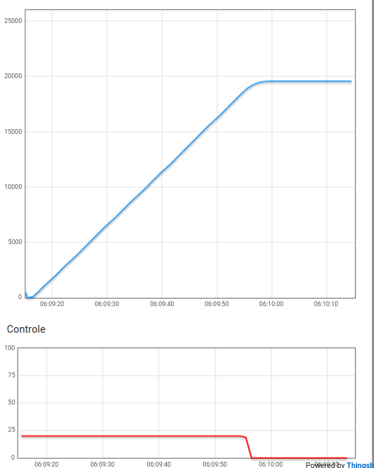
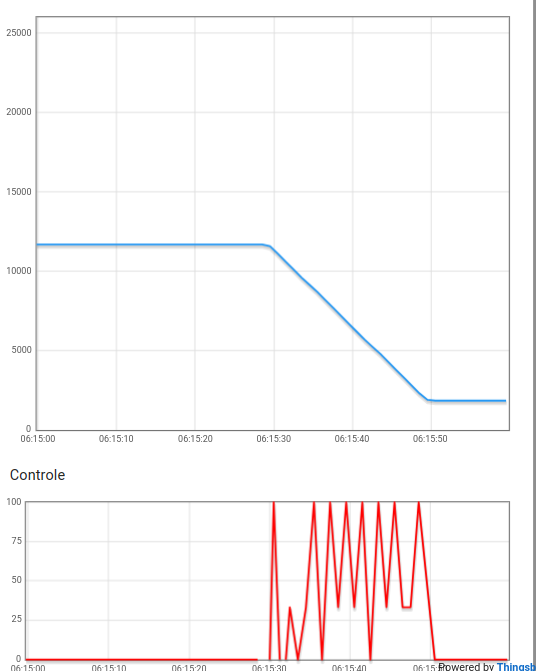
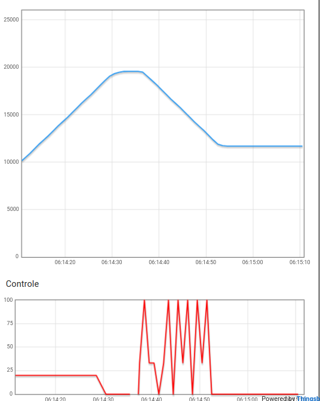

## Apresentação

[Clique aqui para abrir a apresentação.](https://www.youtube.com/watch?v=rvOFNjYXXkA)

## Como rodar

No dashboard, clique no botão "Reinicia Dashboard". Abra, na raspberry, o diretório `elevador`. Compile usando o comando `make`. Execute o binário resultante utilizando `./elevador`.

## Explicação do sistema e exemplos em gráficos

Num primeiro momento, o sistema realiza um procedimento de calibração, ou seja, vai obter as posições dos 4 andares. A imagem abaixo mostra isso: a potência do motor fica em 20, de forma constante. O elevador passa pelos três andares, e sempre que o sensor (GPIO) for acionado, uma requisição à UART é feita para obter o valor na vertical daquele andar.

Depois, ele fica livre para atender as requisições do usuário. As imagens abaixo exemplificam o que acontece:

No primeiro exemplo, o elevador vai do segundo andar para o térreo.

No segundo exemplo, o elevador vai do terceiro andar para o segundo.

No terceiro exemplo, o elevador vai do terceiro andar para o primeiro.

## Módulos do sistema

O sistema é dividido em módulos. Os arquivos são divididos em .h e .c. Os arquivos .h tem as assinaturas das funções e suas documentações. Os arquivos .c tem as implementações em si. O `Makefile` é utilizado para compilar tudo.

- `control_lcd_16x2`: Módulo de uso do lcd. Escreve o status atual do elevador (i.e., se está parado em um andar, subindo, descendo ou sendo calibrado) e a temperatura atual.
- `crc16`: realiza o cálculo do CRC16, para uso no protocolo MODBUS.
- `fila`: implementação de uma estrutura de dados FIFO. 
- `pid`: realiza o cálculo do PID.
- `utils_raspberry`: funções de utilidade para setar e desligar a Raspberry Pi.
- `modbus`: Monta os buffers de comunicação com a UART e realiza essa comunicação, com base nos requisitos do sistema.
- `elevador`: Implementação do elevador em si. Primeiramente, calibra o elevador. Depois, uma thread escuta requisições de usuário (apertar os botões do elevador) e a thread main move o elevador via pwm, com base nas requisições do usuário.
